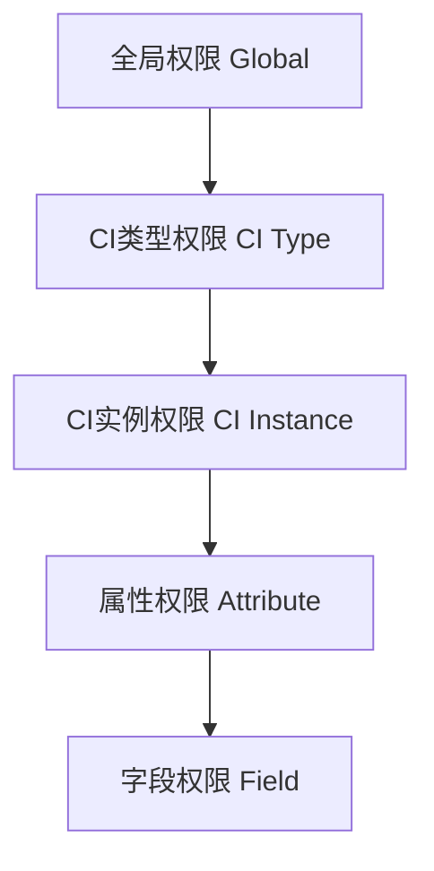
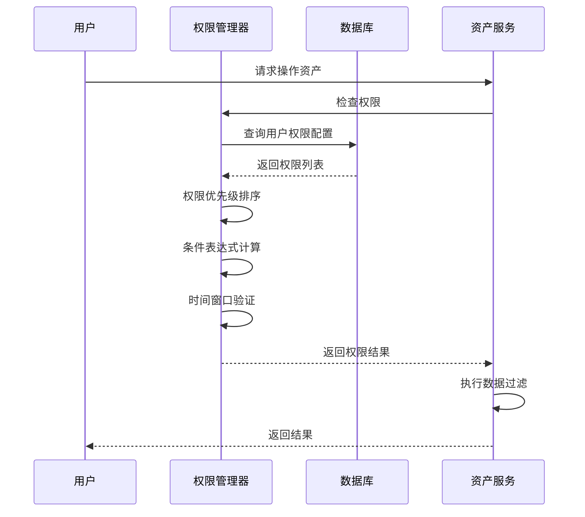

# CI权限控制系统设计分析报告

> **Version**: 1.0  
> **Last Update**: 2024-12-19  
> **Author**: @架构分析团队  

## 目录
- [系统概述](#系统概述)
- [设计思想分析](#设计思想分析)
- [权限控制机制](#权限控制机制)
- [数据库设计分析](#数据库设计分析)
- [与资产管理系统集成](#与资产管理系统集成)
- [优点分析](#优点分析)
- [缺点分析](#缺点分析)
- [改进建议](#改进建议)
- [实际应用场景](#实际应用场景)

## 系统概述

CI权限控制系统是一个基于RBAC+ABAC混合模型的细粒度权限管理系统，专为CMDB资产管理场景设计。系统支持从全局到字段级别的多层次权限控制，并集成了时间控制、条件过滤、审批流程等高级特性。

### 核心特性
- **多维度权限范围**: 支持全局、CI类型、CI实例、属性、字段五个层级
- **灵活主体管理**: 支持用户、角色、部门、用户组、系统等多种权限主体
- **动态权限控制**: 基于条件表达式的动态权限判断
- **时间敏感权限**: 支持临时权限和时间窗口控制
- **权限继承机制**: 支持权限的层级继承和传播
- **审批工作流**: 集成权限变更审批流程

## 设计思想分析

### 1. 层级化权限设计



**设计理念**:
- 权限粒度从粗到细，支持不同业务场景的需求
- 采用"就近原则"，优先使用最具体的权限配置
- 支持权限的逐级细化和特殊化

### 2. 多主体权限模型

```typescript
enum SubjectType {
  USER = "user",           // 个人用户权限
  ROLE = "role",           // 角色权限（RBAC）
  DEPARTMENT = "department", // 部门权限（组织架构）
  GROUP = "group",         // 用户组权限（业务分组）
  SYSTEM = "system"        // 系统级权限
}
```

**设计优势**:
- 支持多种权限授权模式
- 便于权限的批量管理和维护
- 适应不同组织结构需求

### 3. 条件化权限控制

```json
{
  "conditions": {
    "field": "status",
    "operator": "eq", 
    "value": "active",
    "logic": "and"
  },
  "data_filters": {
    "rules": [
      {
        "field": "department_id",
        "operator": "in",
        "value": [1001, 1002, 1003]
      }
    ],
    "logic": "and"
  }
}
```

**设计理念**:
- 支持基于数据内容的动态权限判断
- 实现行级权限控制（Row-Level Security）
- 支持复杂的业务规则表达

## 权限控制机制

### 1. 权限判断流程



### 2. 权限优先级算法

```go
// 权限优先级计算逻辑
func CalculatePermissionPriority(permissions []CiPermission) CiPermission {
    // 1. 按scope_type细化程度排序：field > attribute > ci_instance > ci_type > global
    // 2. 按permission_type排序：deny > allow
    // 3. 按priority数值排序：数值越大优先级越高
    // 4. 按创建时间排序：越新的权限优先级越高
}
```

### 3. 数据过滤机制

```go
// 数据过滤实现
func ApplyDataFilters(query *Query, permissions []CiPermission) *Query {
    for _, perm := range permissions {
        if perm.DataFilters != nil {
            for _, rule := range perm.DataFilters.Rules {
                switch rule.Operator {
                case "eq":
                    query = query.Where(fmt.Sprintf("%s = ?", rule.Field), rule.Value)
                case "in":
                    query = query.Where(fmt.Sprintf("%s IN (?)", rule.Field), rule.Value)
                // ... 其他操作符
                }
            }
        }
    }
    return query
}
```

## 数据库设计分析

### 1. 表结构优势

**字段设计合理性**:
- ✅ 权限范围字段设计层级清晰
- ✅ 主体信息字段完整（ID、名称、编码）
- ✅ 时间控制字段支持复杂时间策略
- ✅ JSON字段存储复杂结构，灵活性高

**索引设计优化**:
```sql
-- 核心查询优化索引
CREATE INDEX idx_permission_lookup ON cmdb_ci_permissions(scope_type, subject_type, status);
CREATE INDEX idx_subject_permission ON cmdb_ci_permissions(subject_id, scope_type);
CREATE INDEX idx_ci_type_permission ON cmdb_ci_permissions(ci_type_id, subject_type, status);

-- 时间范围查询优化
CREATE INDEX idx_effective_time ON cmdb_ci_permissions(effective_from, effective_to);
```

### 2. 数据存储效率

**JSON字段使用分析**:
- ✅ `operations`: 存储复杂操作列表，查询频率低
- ✅ `conditions`: 存储条件表达式，需要应用层解析
- ⚠️ `data_filters`: 可能需要SQL层面的条件查询
- ⚠️ `usage_statistics`: 频繁更新可能影响性能

## 与资产管理系统集成

### 1. 权限检查集成点

```go
// 资产查询时的权限集成
func (l *GetCisListLogic) GetCisList(req *cmdb.CisListReq) (*cmdb.CisListResp, error) {
    // 1. 获取用户权限配置
    permissions, err := l.getEffectivePermissions(l.ctx, userID, "read")
    if err != nil {
        return nil, err
    }
    
    // 2. 构建基础查询
    query := l.svcCtx.DB.Cis.Query()
    
    // 3. 应用权限过滤
    query = l.applyPermissionFilters(query, permissions)
    
    // 4. 应用字段掩码
    query = l.applyFieldMasks(query, permissions)
    
    // 5. 执行查询
    results, err := query.All(l.ctx)
    
    // 6. 后处理敏感字段
    return l.processSensitiveFields(results, permissions), nil
}
```

### 2. 权限检查性能优化

```go
// 权限缓存机制
type PermissionCache struct {
    userPermissions map[string][]CiPermission
    expirationTime  map[string]time.Time
    mutex          sync.RWMutex
}

func (c *PermissionCache) GetUserPermissions(userID string) []CiPermission {
    c.mutex.RLock()
    defer c.mutex.RUnlock()
    
    if permissions, exists := c.userPermissions[userID]; exists {
        if time.Now().Before(c.expirationTime[userID]) {
            return permissions
        }
    }
    return nil
}
```

### 3. 操作权限验证

```go
// 写操作权限验证
func (l *CreateCisLogic) CreateCis(req *cmdb.CisInfo) (*cmdb.BaseIDResp, error) {
    // 1. 检查创建权限
    hasPermission, err := l.checkOperationPermission(userID, "create", req.CiTypeId)
    if err != nil || !hasPermission {
        return nil, fmt.Errorf("没有创建权限")
    }
    
    // 2. 检查字段级权限
    err = l.validateFieldPermissions(userID, req, "write")
    if err != nil {
        return nil, err
    }
    
    // 3. 执行创建操作
    return l.performCreate(req)
}
```

## 优点分析

### 1. 设计优势

**1.1 权限粒度细化**
- ✅ 支持5个层级的权限控制，满足不同业务场景
- ✅ 字段级权限控制，保护敏感信息
- ✅ 操作级权限控制，精确控制用户行为

**1.2 灵活的权限模型**
- ✅ RBAC+ABAC混合模型，兼顾简单性和灵活性
- ✅ 支持权限继承，减少配置复杂度
- ✅ 条件表达式支持，实现动态权限判断

**1.3 完善的审计功能**
- ✅ 权限使用统计，便于权限管理优化
- ✅ 完整的审计字段，满足合规要求
- ✅ 权限变更审批，确保权限安全

**1.4 时间控制能力**
- ✅ 临时权限支持，满足临时授权需求
- ✅ 时间窗口控制，增强安全性
- ✅ 权限过期自动处理

### 2. 技术优势

**2.1 数据库设计**
- ✅ 索引设计合理，查询性能良好
- ✅ JSON字段存储复杂结构，扩展性强
- ✅ 约束设计完善，数据完整性好

**2.2 扩展性设计**
- ✅ 元数据和标签支持，便于扩展
- ✅ 自定义字段支持，适应不同需求
- ✅ 多租户支持，满足SaaS场景

## 缺点分析

### 1. 性能问题

**1.1 查询复杂度高**
- ❌ 权限判断需要多表关联查询
- ❌ JSON字段条件查询性能较差
- ❌ 复杂的权限继承计算耗时

**1.2 缓存依赖**
- ❌ 权限变更后缓存失效问题
- ❌ 分布式环境下缓存一致性
- ❌ 内存占用随用户数量增长

### 2. 复杂度问题

**2.1 配置复杂**
- ❌ 权限配置过于复杂，管理困难
- ❌ 权限冲突解决逻辑复杂
- ❌ 调试和排查权限问题困难

**2.2 学习成本**
- ❌ 管理员需要理解复杂的权限模型
- ❌ 开发人员需要深入理解权限机制
- ❌ 权限配置错误风险高

### 3. 功能局限

**3.1 实时性问题**
- ❌ 权限变更可能有延迟
- ❌ 临时权限的精确控制困难
- ❌ 动态权限计算开销大

**3.2 集成复杂性**
- ❌ 与现有系统集成需要大量改造
- ❌ 权限检查分散在各个业务逻辑中
- ❌ 权限规则的一致性难以保证

## 改进建议

### 1. 性能优化建议

**1.1 权限计算优化**
```go
// 建议：权限预计算和缓存
type EffectivePermission struct {
    UserID          string
    ResourceType    string
    ResourceID      string
    AllowedOps      []string
    DataFilters     map[string]interface{}
    FieldMasks      []string
    ExpirationTime  time.Time
}

// 权限预计算服务
type PermissionCalculationService struct {
    cache map[string]EffectivePermission
}

func (s *PermissionCalculationService) PreCalculatePermissions(userID string) {
    // 定期预计算用户权限，存入缓存
    // 减少实时计算开销
}
```

**1.2 索引优化建议**
```sql
-- 建议添加的索引
CREATE INDEX idx_permission_effective ON cmdb_ci_permissions(subject_id, status, effective_from, effective_to);
CREATE INDEX idx_permission_hierarchy ON cmdb_ci_permissions(parent_permission_id, inheritable);
CREATE INDEX idx_permission_usage ON cmdb_ci_permissions(last_used_at, usage_count);

-- 分区表优化（按租户分区）
ALTER TABLE cmdb_ci_permissions PARTITION BY HASH(tenant_id) PARTITIONS 16;
```

### 2. 架构改进建议

**2.1 权限服务化**
```go
// 建议：独立权限服务
type PermissionService interface {
    CheckPermission(ctx context.Context, req *PermissionCheckRequest) (*PermissionResult, error)
    GetEffectivePermissions(ctx context.Context, userID string) ([]EffectivePermission, error)
    ApplyDataFilters(ctx context.Context, query interface{}, permissions []EffectivePermission) interface{}
}

// 统一权限检查入口
func (s *PermissionService) CheckPermission(ctx context.Context, req *PermissionCheckRequest) (*PermissionResult, error) {
    // 1. 获取用户有效权限
    // 2. 应用权限过滤规则  
    // 3. 返回权限结果和数据过滤条件
}
```

**2.2 权限决策缓存**
```go
// 建议：权限决策结果缓存
type PermissionDecisionCache struct {
    decisions map[string]*PermissionDecision
    ttl       time.Duration
}

type PermissionDecision struct {
    UserID      string
    Resource    string
    Operation   string
    Allowed     bool
    DataFilters map[string]interface{}
    ExpiresAt   time.Time
}
```

### 3. 功能增强建议

**3.1 权限模板机制**
```go
// 建议：权限模板简化配置
type PermissionTemplate struct {
    ID          string
    Name        string
    Description string
    Rules       []PermissionRule
    Variables   map[string]string
}

// 常用权限模板
var CommonTemplates = []PermissionTemplate{
    {
        ID:   "ci_read_only",
        Name: "CI只读权限",
        Rules: []PermissionRule{
            {ScopeType: "ci_type", Operations: []string{"read"}},
        },
    },
    {
        ID:   "ci_admin",
        Name: "CI管理员权限", 
        Rules: []PermissionRule{
            {ScopeType: "ci_type", Operations: []string{"read", "write", "delete"}},
        },
    },
}
```

**3.2 权限规则验证**
```go
// 建议：权限规则一致性检查
type PermissionValidator struct{}

func (v *PermissionValidator) ValidatePermissionRules(permissions []CiPermission) []ValidationError {
    var errors []ValidationError
    
    // 1. 检查权限冲突
    errors = append(errors, v.checkPermissionConflicts(permissions)...)
    
    // 2. 检查权限继承合理性
    errors = append(errors, v.checkInheritanceValidity(permissions)...)
    
    // 3. 检查权限覆盖完整性
    errors = append(errors, v.checkPermissionCoverage(permissions)...)
    
    return errors
}
```

### 4. 监控和观测性改进

**4.1 权限使用监控**
```go
// 建议：权限使用监控
type PermissionMonitor struct {
    metrics map[string]*PermissionMetrics
}

type PermissionMetrics struct {
    CheckCount      int64
    DeniedCount     int64
    AvgResponseTime time.Duration
    ErrorRate       float64
}

func (m *PermissionMonitor) RecordPermissionCheck(userID, resource, operation string, allowed bool, duration time.Duration) {
    // 记录权限检查指标
}
```

**4.2 权限审计增强**
```go
// 建议：详细的权限审计日志
type PermissionAuditLog struct {
    Timestamp    time.Time
    UserID       string
    Resource     string
    Operation    string
    Allowed      bool
    DenyReason   string
    AppliedRules []string
    DataFilters  map[string]interface{}
    RequestID    string
}
```

## 实际应用场景

### 1. 典型权限配置场景

**场景1：部门级数据隔离**
```json
{
  "permission_id": "dept_isolation_001",
  "scope_type": "global",
  "subject_type": "department", 
  "subject_id": "dept_001",
  "data_filters": {
    "rules": [
      {
        "field": "department_id",
        "operator": "eq",
        "value": "dept_001"
      }
    ],
    "logic": "and"
  }
}
```

**场景2：临时权限授权**
```json
{
  "permission_id": "temp_access_002",
  "scope_type": "ci_instance",
  "ci_id": 12345,
  "subject_type": "user",
  "subject_id": "user_001", 
  "is_temporary": true,
  "effective_from": "2024-12-19T09:00:00Z",
  "effective_to": "2024-12-19T18:00:00Z",
  "require_approval": true
}
```

**场景3：敏感字段保护**
```json
{
  "permission_id": "sensitive_field_003",
  "scope_type": "field",
  "field_name": "password",
  "subject_type": "role",
  "permission_type": "deny",
  "field_masks": {
    "fields": ["password", "secret_key", "private_key"]
  }
}
```

### 2. 集成实施建议

**阶段1：基础权限实施**
1. 实现用户和角色级别的基础权限控制
2. 支持CI类型级别的权限配置
3. 实现基本的CRUD操作权限检查

**阶段2：精细化权限控制**
1. 实现字段级权限控制
2. 添加数据过滤功能
3. 支持条件表达式权限判断

**阶段3：高级功能实施**
1. 实现权限继承机制
2. 添加审批工作流
3. 完善权限监控和审计

## 总结

CI权限控制系统设计思想先进，功能完备，能够满足复杂的企业级权限管理需求。但在实际实施中需要注意性能优化、配置简化和监控完善等方面的问题。

**关键成功因素**：
1. 合理的权限模型设计和实施策略
2. 有效的性能优化和缓存机制
3. 完善的监控和运维体系
4. 持续的权限治理和优化

**建议实施路径**：
1. 先实施基础权限功能，逐步完善
2. 重视性能测试和优化
3. 建立完善的权限管理流程
4. 定期进行权限审计和清理

---

*此报告基于当前系统设计进行分析，建议结合实际业务需求和技术条件进行有针对性的改进。* 