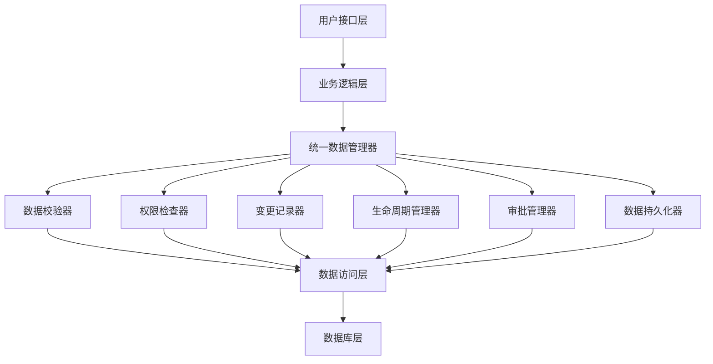

# 统一CI数据操作架构设计文档

> **Version**: 1.0  
> **Last Update**: 2024-12-19  
> **Author**: @CMDB Team  

## 目录
- [项目背景](#项目背景)
- [设计目标](#设计目标)
- [架构概览](#架构概览)
- [核心组件](#核心组件)
- [数据库设计](#数据库设计)
- [使用指南](#使用指南)
- [性能优化](#性能优化)
- [安全控制](#安全控制)
- [扩展开发](#扩展开发)
- [故障排查](#故障排查)

## 项目背景

当前CMDB系统的数据操作分散在各个logic文件中，缺乏统一的数据更新、入库、删除、覆盖、记录变更、规则校验、审批、权限校验等流程。此架构设计旨在提供统一的数据操作基础设施，确保所有数据操作都通过标准化的流程进行。

### 现状问题
- 数据操作逻辑分散，维护困难
- 缺乏统一的权限控制
- 数据变更记录不完整
- 校验规则不一致
- 审批流程缺失

### 解决方案
设计统一的CI数据操作架构，提供标准化的数据操作API，确保所有CI数据操作都经过统一的流程处理。

## 设计目标

### 核心功能要求
1. **资产管理**: 具备对资产的增删改查功能
2. **数据校验**: 具备根据模型下的属性进行数据规则校验
3. **变更记录**: 具备数据变更记录，记录数据变更情况
4. **生命周期管理**: 具备数据生命周期管理
5. **权限控制**: 具备数据权限校验，结合casbin_rules进行多重角色授权
6. **审批流程**: 具备审计功能，支持审批流程

### 非功能要求
- **高性能**: 支持高并发数据操作
- **高扩展性**: 支持组件化扩展
- **多兼容性**: 支持多种数据操作场景
- **高可用性**: 具备故障恢复能力

## 架构概览

### 分层架构设计



### 核心设计原则
1. **单一职责**: 每个组件专注于特定功能
2. **依赖倒置**: 基于接口编程，支持组件替换
3. **开闭原则**: 对扩展开放，对修改封闭
4. **配置驱动**: 支持配置化的行为控制

## 核心组件

### 1. 统一数据管理器 (CiDataManager)

**职责**: 协调所有子组件，提供统一的数据操作API

**核心方法**:
```go
type CiDataManager interface {
    // 基础CRUD操作
    CreateCi(ctx context.Context, operation *CiOperationContext) (*CiOperationResult, error)
    UpdateCi(ctx context.Context, operation *CiOperationContext) (*CiOperationResult, error)
    DeleteCi(ctx context.Context, operation *CiOperationContext) (*CiOperationResult, error)
    GetCi(ctx context.Context, ciID uint64, operatorID uuid.UUID) (*cmdb.CisInfo, error)

    // 批量操作
    BatchCreate(ctx context.Context, operation *CiOperationContext) (*CiOperationResult, error)
    BatchUpdate(ctx context.Context, operation *CiOperationContext) (*CiOperationResult, error)
    BatchDelete(ctx context.Context, operation *CiOperationContext) (*CiOperationResult, error)

    // 高级操作
    BulkImport(ctx context.Context, operation *CiOperationContext) (*CiOperationResult, error)
    SyncData(ctx context.Context, operation *CiOperationContext) (*CiOperationResult, error)
}
```

### 2. 数据校验器 (DataValidator)

**职责**: 负责所有数据校验逻辑

**校验类型**:
- **Schema校验**: 数据结构和类型校验
- **业务规则校验**: 自定义业务逻辑校验
- **唯一性校验**: 数据唯一性约束检查
- **完整性校验**: 数据完整性验证

### 3. 权限检查器 (PermissionChecker)

**职责**: 负责权限控制和访问控制

**权限类型**:
- **操作权限**: 增删改查操作权限
- **字段权限**: 字段级别的访问控制
- **数据权限**: 基于数据内容的权限控制
- **批量权限**: 批量操作的权限验证

### 4. 变更记录器 (ChangeRecorder)

**职责**: 记录所有数据变更历史

**记录内容**:
- 变更前后数据对比
- 操作者信息
- 变更时间和原因
- 变更影响范围

### 5. 生命周期管理器 (LifecycleManager)

**职责**: 管理CI数据的生命周期状态

**生命周期阶段**:
- `draft`: 草稿状态
- `submitted`: 已提交
- `validated`: 已校验
- `approved`: 已审批
- `executed`: 已执行
- `completed`: 已完成

### 6. 审批管理器 (ApprovalManager)

**职责**: 处理数据变更的审批流程

**审批类型**:
- `sequential`: 顺序审批
- `parallel`: 并行审批
- `hybrid`: 混合审批
- `auto`: 自动审批

## 数据库设计

### 1. CI操作记录表 (ci_operations)

存储所有CI数据操作的详细记录

```sql
CREATE TABLE ci_operations (
    id VARCHAR(255) PRIMARY KEY,
    operation_type VARCHAR(50) NOT NULL,
    operation_status VARCHAR(50) NOT NULL,
    ci_id BIGINT,
    ci_type_id BIGINT NOT NULL,
    operator_id VARCHAR(255) NOT NULL,
    operator_name VARCHAR(255) NOT NULL,
    source VARCHAR(50) NOT NULL,
    reason TEXT,
    data_before LONGTEXT,
    data_after LONGTEXT,
    validation_level VARCHAR(50),
    require_approval BOOLEAN DEFAULT FALSE,
    async_execution BOOLEAN DEFAULT FALSE,
    created_at TIMESTAMP DEFAULT CURRENT_TIMESTAMP,
    updated_at TIMESTAMP DEFAULT CURRENT_TIMESTAMP ON UPDATE CURRENT_TIMESTAMP
);
```

### 2. CI权限配置表 (ci_permissions)

管理CI数据的细粒度权限控制

```sql
CREATE TABLE ci_permissions (
    id VARCHAR(255) PRIMARY KEY,
    permission_name VARCHAR(255) NOT NULL,
    permission_scope VARCHAR(50) NOT NULL,
    subject_type VARCHAR(50) NOT NULL,
    subject_id VARCHAR(255) NOT NULL,
    object_type VARCHAR(50) NOT NULL,
    object_id VARCHAR(255),
    operations TEXT,
    conditions LONGTEXT,
    created_at TIMESTAMP DEFAULT CURRENT_TIMESTAMP,
    updated_at TIMESTAMP DEFAULT CURRENT_TIMESTAMP ON UPDATE CURRENT_TIMESTAMP
);
```

### 3. CI审批流程表 (ci_approval_flows)

管理CI数据变更的审批流程配置

```sql
CREATE TABLE ci_approval_flows (
    id VARCHAR(255) PRIMARY KEY,
    flow_name VARCHAR(255) NOT NULL,
    flow_type VARCHAR(50) NOT NULL,
    ci_type_id BIGINT,
    operation_types TEXT,
    trigger_conditions LONGTEXT,
    approver_config LONGTEXT NOT NULL,
    timeout_hours INT DEFAULT 24,
    notification_config LONGTEXT,
    created_at TIMESTAMP DEFAULT CURRENT_TIMESTAMP,
    updated_at TIMESTAMP DEFAULT CURRENT_TIMESTAMP ON UPDATE CURRENT_TIMESTAMP
);
```

### 4. CI生命周期状态表 (ci_lifecycle_states)

跟踪CI数据的生命周期状态变化

```sql
CREATE TABLE ci_lifecycle_states (
    id VARCHAR(255) PRIMARY KEY,
    state_name VARCHAR(255) NOT NULL,
    state_type VARCHAR(50) NOT NULL,
    ci_id BIGINT NOT NULL,
    ci_type_id BIGINT NOT NULL,
    entered_at TIMESTAMP NOT NULL,
    expected_exit_at TIMESTAMP,
    trigger_type VARCHAR(50) NOT NULL,
    triggered_by VARCHAR(255) NOT NULL,
    state_data LONGTEXT,
    created_at TIMESTAMP DEFAULT CURRENT_TIMESTAMP,
    updated_at TIMESTAMP DEFAULT CURRENT_TIMESTAMP ON UPDATE CURRENT_TIMESTAMP
);
```

## 使用指南

### 1. 基本使用示例

```go
package main

import (
    "context"
    "gitee.com/link234/cmdb-rpc/internal/core"
    "gitee.com/link234/cmdb-rpc/internal/svc"
)

func main() {
    // 初始化服务上下文
    svcCtx := &svc.ServiceContext{} // 实际初始化

    // 创建数据管理器
    config := core.DefaultConfiguration()
    manager := core.NewCiDataManager(svcCtx, config)

    // 初始化管理器
    ctx := context.Background()
    if err := manager.Initialize(ctx); err != nil {
        panic(err)
    }
    defer manager.Shutdown(ctx)

    // 创建CI实例
    operation := &core.CiOperationContext{
        Type:            core.OperationCreate,
        Source:          core.SourceManual,
        OperatorID:      operatorID,
        CiTypeID:        1,
        ValidationLevel: core.ValidationStrict,
        // ... 其他字段
    }

    result, err := manager.CreateCi(ctx, operation)
    if err != nil {
        // 处理错误
    }
    
    // 处理结果
    fmt.Printf("操作结果: %+v\n", result)
}
```

### 2. 批量操作示例

```go
// 批量创建CI
batchOperation := &core.CiOperationContext{
    Type:         core.OperationBatchCreate,
    Source:       core.SourceImport,
    OperatorID:   operatorID,
    CiTypeID:     1,
    BatchData:    ciList, // []*cmdb.CisInfo
    AsyncExecution: true, // 异步执行
}

result, err := manager.BatchCreate(ctx, batchOperation)
```

### 3. 权限检查示例

```go
// 检查用户是否有删除权限
deleteOperation := &core.CiOperationContext{
    Type:       core.OperationDelete,
    OperatorID: userID,
    CiID:       &ciID,
    CiTypeID:   typeID,
}

result, err := manager.DeleteCi(ctx, deleteOperation)
// 自动进行权限检查，权限不足会返回错误
```

### 4. 审批流程示例

```go
// 提交需要审批的操作
createOperation := &core.CiOperationContext{
    Type:            core.OperationCreate,
    RequireApproval: true,
    // ... 其他字段
}

result, err := manager.CreateCi(ctx, createOperation)
if result.RequireApproval {
    // 提交审批
    err = manager.SubmitForApproval(ctx, result.OperationID)
}
```

## 性能优化

### 1. 缓存策略

- **权限缓存**: 缓存用户权限信息，减少权限查询
- **校验缓存**: 缓存校验规则，提高校验效率
- **配置缓存**: 缓存系统配置，减少配置读取

### 2. 批量处理

- **批量校验**: 批量数据使用批量校验接口
- **批量权限检查**: 一次性检查批量操作权限
- **批量数据库操作**: 使用事务进行批量数据操作

### 3. 异步处理

- **异步执行**: 大批量操作支持异步执行
- **消息队列**: 使用消息队列处理耗时操作
- **状态查询**: 提供操作状态查询接口

### 4. 性能监控

```go
type PerformanceMetrics struct {
    TotalOperations   int64
    SuccessOperations int64
    FailedOperations  int64
    AvgExecutionTime  time.Duration
    MaxExecutionTime  time.Duration
    ValidationTime    time.Duration
    PermissionTime    time.Duration
    PersistenceTime   time.Duration
}
```

## 安全控制

### 1. 权限模型

采用RBAC (基于角色的访问控制) 和 ABAC (基于属性的访问控制) 混合模型：

- **用户角色权限**: 基于用户角色的权限控制
- **数据级权限**: 基于数据内容的权限控制
- **字段级权限**: 精确到字段的权限控制
- **操作权限**: 针对不同操作类型的权限控制

### 2. 数据安全

- **敏感数据脱敏**: 在日志和变更记录中脱敏敏感信息
- **数据加密**: 敏感字段支持加密存储
- **审计日志**: 完整的操作审计日志
- **访问控制**: 严格的访问控制和身份验证

### 3. 输入验证

- **SQL注入防护**: 使用参数化查询
- **XSS防护**: 输入数据清理和转义
- **数据类型验证**: 严格的数据类型和格式验证
- **大小限制**: 对输入数据大小进行限制

## 扩展开发

### 1. 自定义校验器

```go
type CustomValidator struct {
    // 实现DataValidator接口
}

func (v *CustomValidator) ValidateBusinessRules(ctx context.Context, data *cmdb.CisInfo, typeID uint64) (*ValidationResult, error) {
    // 自定义业务规则校验逻辑
    return &ValidationResult{
        Valid: true,
        // ... 其他字段
    }, nil
}
```

### 2. 自定义权限检查器

```go
type CustomPermissionChecker struct {
    // 实现PermissionChecker接口
}

func (p *CustomPermissionChecker) CheckPermission(ctx context.Context, operation *CiOperationContext) (*PermissionResult, error) {
    // 自定义权限检查逻辑
    return &PermissionResult{
        Granted: true,
        Level:   PermissionWrite,
        // ... 其他字段
    }, nil
}
```

### 3. 自定义审批流程

```go
type CustomApprovalManager struct {
    // 实现ApprovalManager接口
}

func (a *CustomApprovalManager) CheckRequireApproval(ctx context.Context, operation *CiOperationContext) (bool, string, error) {
    // 自定义审批需求检查逻辑
    return true, "需要部门主管审批", nil
}
```

## 故障排查

### 1. 日志等级

- **DEBUG**: 详细的调试信息
- **INFO**: 一般操作信息
- **WARN**: 警告信息
- **ERROR**: 错误信息

### 2. 常见问题

#### 权限问题
- **现象**: 操作被拒绝，返回权限不足错误
- **排查**: 检查用户角色、权限配置、数据级权限
- **解决**: 调整权限配置或联系管理员

#### 校验失败
- **现象**: 数据校验失败，操作被阻止
- **排查**: 查看校验错误详情，检查数据格式和业务规则
- **解决**: 修正数据或调整校验规则

#### 性能问题
- **现象**: 操作响应慢或超时
- **排查**: 查看性能监控指标，分析慢查询
- **解决**: 优化查询、增加缓存、调整批量大小

### 3. 监控指标

- **操作成功率**: 成功操作数 / 总操作数
- **平均响应时间**: 操作平均执行时间
- **错误率**: 错误操作数 / 总操作数
- **资源使用率**: CPU、内存、数据库连接使用情况

## 总结

统一CI数据操作架构提供了一个完整、安全、高性能的数据操作基础设施。通过组件化设计和标准化流程，确保了所有CI数据操作的一致性和可靠性。

### 主要优势

1. **统一性**: 所有数据操作通过统一接口
2. **安全性**: 完善的权限控制和审计机制
3. **可扩展性**: 组件化设计支持功能扩展
4. **高性能**: 优化的执行流程和缓存机制
5. **易维护**: 清晰的架构设计和文档

### 后续计划

1. **工单集成**: 与工单系统集成实现完整审批流程
2. **监控告警**: 完善监控和告警机制
3. **性能优化**: 持续优化性能和资源使用
4. **功能增强**: 根据业务需求增加新功能

---

*此文档会随着架构的演进持续更新，请关注版本变更信息。* 