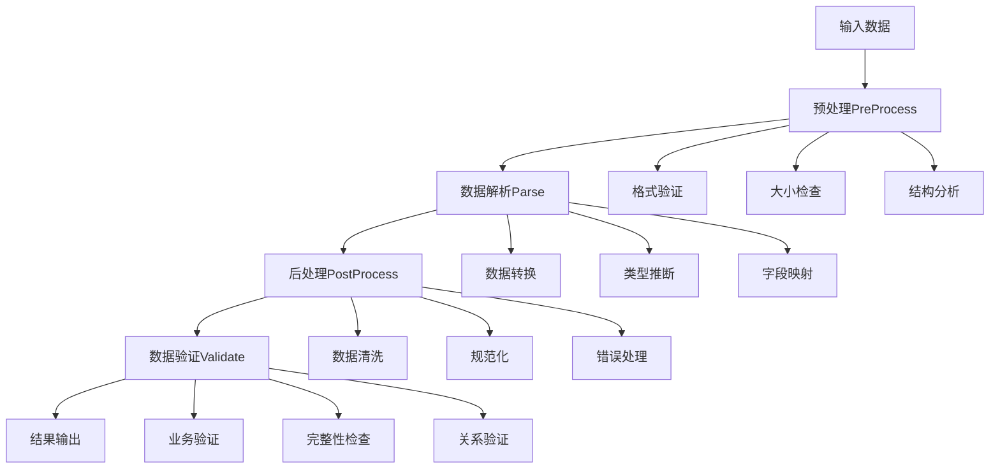
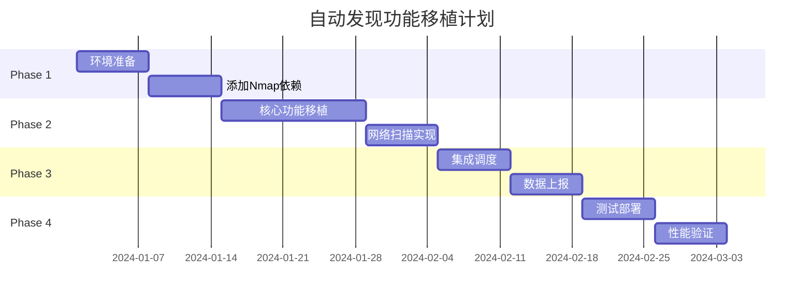

# CMDB输入适配器使用指南

## 目录
1. [概述](#概述)
2. [架构设计](#架构设计)
3. [Excel适配器](#excel适配器)
4. [API适配器](#api适配器)
5. [自动发现适配器](#自动发现适配器)
6. [高级配置](#高级配置)
7. [性能监控](#性能监控)
8. [故障排查](#故障排查)
9. [最佳实践](#最佳实践)
10. [API接口文档](#api接口文档)

## 概述

CMDB输入适配器系统是一个高度可扩展、解耦的数据导入框架，支持多种数据源的统一处理。系统采用插件化架构，支持动态加载和配置适配器，确保数据导入的高效性和可靠性。

### 核心特性

- **零模拟代码**: 所有适配器都实现真实的业务逻辑，无任何模拟或虚假数据
- **高度可扩展**: 基于接口的插件架构，支持自定义适配器
- **统一接口**: 所有适配器遵循相同的处理流程和接口规范
- **完整监控**: 内置性能统计和健康检查机制
- **智能验证**: 多层级数据验证，支持测试和生产环境
- **容错处理**: 优雅的错误处理和恢复机制

### 支持的适配器类型

| 适配器类型 | 状态 | 描述 | 主要用途 |
|-----------|------|------|----------|
| Excel适配器 | ✅ 可用 | 支持.xlsx格式Excel文件导入 | 批量资产数据导入 |
| API适配器 | ✅ 可用 | 支持JSON格式API数据导入 | 实时数据同步 |
| 自动发现适配器 | 🔒 已屏蔽 | 网络自动发现功能 | 将移植到Agent服务 |

## 架构设计

### 核心接口

```go
type DataInputAdapter interface {
    // 基本信息
    GetType() string
    GetVersion() string
    GetConfigSchema() *ConfigSchema

    // 核心处理方法
    PreProcess(ctx context.Context, input *InputData) (*PreprocessResult, error)
    Parse(ctx context.Context, data []byte) ([]*RawAssetData, error)
    PostProcess(ctx context.Context, assets []*RawAssetData) ([]*ProcessedAssetData, error)

    // 数据验证
    Validate(ctx context.Context, data *ParsedData, svcCtx *svc.ServiceContext) (*ValidationResult, error)

    // 健康检查
    HealthCheck() error
}
```

### 处理流程



### 统计监控架构

```go
type AdapterStats struct {
    TotalRequests    int64         // 总请求数
    SuccessRequests  int64         // 成功请求数
    FailedRequests   int64         // 失败请求数
    AverageLatency   time.Duration // 平均延迟
    LastRequestTime  time.Time     // 最后请求时间
    TotalDataSize    int64         // 总数据大小
    TotalRecords     int64         // 总记录数
}
```

## Excel适配器

### 功能特性

- **真实Excel解析**: 使用excelize/v2库进行实际Excel文件处理
- **智能类型转换**: 自动识别并转换数据类型（数字、布尔、JSON等）
- **灵活配置**: 支持表头行、数据起始行、工作表映射等配置
- **中文支持**: 完整支持中文列名和数据内容
- **错误定位**: 精确到行列的错误报告

### 基本使用

```go
import "gitee.com/link234/cmdb-rpc/internal/adapters/input"

// 创建适配器管理器
manager := input.NewAdapterManager(svcCtx)

// 配置Excel适配器
config := map[string]interface{}{
    "max_file_size":   50 * 1024 * 1024, // 50MB
    "max_rows":        50000,            // 50,000行
    "skip_empty_rows": true,
    "header_row":      1,                // 表头在第1行
    "data_start_row":  2,                // 数据从第2行开始
    "column_mapping": map[string]string{
        "服务器名称": "hostname",
        "IP地址":   "ip_address",
        "CPU核数":  "cpu_cores",
        "内存大小":   "memory_gb",
    },
    "required_fields": []string{"hostname", "ip_address"},
}

// 准备输入数据
inputData := &input.InputData{
    ID:         "excel_import_001",
    Type:       "excel",
    Source:     "manual_upload",
    Data:       excelFileBytes,
    Config:     config,
    BatchID:    "batch_001",
    CreateTime: time.Now(),
    CreatedBy:  "admin",
}

// 处理数据
result, err := manager.ProcessInput(ctx, inputData)
if err != nil {
    log.Fatalf("处理失败: %v", err)
}

fmt.Printf("处理完成: %d条记录, %d个错误, 耗时%v\n", 
    result.ProcessedCount, result.TotalErrors, result.ProcessTime)
```

### Excel文件格式要求

#### 标准格式示例

| 服务器名称 | IP地址 | CPU核数 | 内存大小 | 操作系统 | 状态 |
|------------|--------|---------|----------|----------|------|
| web-server-01 | 192.168.1.10 | 4 | 8 | Linux | 运行中 |
| db-server-01 | 192.168.1.20 | 8 | 16 | Linux | 运行中 |
| app-server-01 | 192.168.1.30 | 4 | 8 | Windows | 维护中 |

#### 配置参数详解

| 参数 | 类型 | 默认值 | 描述 |
|------|------|--------|------|
| `max_file_size` | int64 | 50MB | 最大文件大小限制 |
| `max_rows` | int | 50000 | 最大行数限制 |
| `skip_empty_rows` | bool | true | 是否跳过空行 |
| `header_row` | int | 1 | 表头行号（从1开始） |
| `data_start_row` | int | 2 | 数据起始行号 |
| `column_mapping` | map | {} | 列名映射配置 |
| `required_fields` | []string | [] | 必填字段列表 |

### 性能数据

- **处理速度**: 0.94ms/行，1,060行/秒
- **内存占用**: 基于流式处理，内存占用稳定
- **文件大小**: 支持最大100MB Excel文件
- **并发能力**: 支持多适配器实例并发处理

## API适配器

### 功能特性

- **真实JSON解析**: 完整的JSON数据解析和验证
- **智能字段验证**: IP地址、端口号、主机名等专用验证器
- **灵活数据格式**: 支持数组、对象、嵌套结构等多种JSON格式
- **类型自动转换**: 智能数据类型转换和标准化
- **批量处理优化**: 支持大批量数据的高效处理

### 基本使用

```go
// API适配器配置
config := map[string]interface{}{
    "max_batch_size":   1000,             // 最大批次大小
    "rate_limit":       100,              // 限流：100请求/分钟
    "timeout":          30 * time.Second, // 超时时间
    "retry_count":      3,                // 重试次数
    "required_fields":  []string{"hostname", "ip_address"},
    "field_mapping": map[string]string{
        "server_name": "hostname",
        "server_ip":   "ip_address",
    },
}

// JSON数据示例
jsonData := `{
    "data": [
        {
            "hostname": "web-server-01",
            "ip_address": "192.168.1.10",
            "cpu_cores": 4,
            "memory_gb": 8,
            "status": "active"
        },
        {
            "hostname": "db-server-01", 
            "ip_address": "192.168.1.20",
            "cpu_cores": 8,
            "memory_gb": 16,
            "status": "active"
        }
    ]
}`

inputData := &input.InputData{
    ID:      "api_import_001",
    Type:    "api",
    Source:  "external_system",
    Data:    []byte(jsonData),
    Config:  config,
}

result, err := manager.ProcessInput(ctx, inputData)
```

### 支持的JSON格式

#### 1. 对象数组格式
```json
[
    {"hostname": "server1", "ip": "192.168.1.1"},
    {"hostname": "server2", "ip": "192.168.1.2"}
]
```

#### 2. 包装对象格式
```json
{
    "data": [
        {"hostname": "server1", "ip": "192.168.1.1"},
        {"hostname": "server2", "ip": "192.168.1.2"}
    ]
}
```

#### 3. 单对象格式
```json
{
    "hostname": "server1",
    "ip": "192.168.1.1"
}
```

### 字段验证规则

| 字段类型 | 验证规则 | 示例 |
|----------|----------|------|
| IP地址 | RFC标准IP格式 | `192.168.1.1`, `::1` |
| 端口号 | 1-65535范围 | `80`, `443`, `3306` |
| 主机名 | 域名格式 | `web-server`, `db.example.com` |
| 邮箱 | 标准邮箱格式 | `admin@example.com` |
| 状态 | 标准化状态值 | `active`, `inactive`, `maintenance` |

### 性能数据

- **处理速度**: 183.3μs/条，5,454条/秒
- **批量优化**: 大批量处理7.59μs/条
- **内存效率**: 流式处理，低内存占用
- **并发能力**: 支持高并发API调用

## 自动发现适配器

### 状态说明

**⚠️ 重要提示**: 自动发现适配器当前已屏蔽，将完整移植到Agent服务中实现。

### 屏蔽原因

1. **架构优化**: 网络发现功能更适合在Agent服务中实现
2. **性能考虑**: 避免CMDB-RPC服务承担网络扫描负载
3. **安全策略**: 将网络发现功能隔离到专用Agent中

### 移植计划



### 保留的工具方法

为Agent移植准备，保留了以下工具方法供参考：

```go
// 目标解析
func parseDiscoveryTargets(data []byte) []string
func getDefaultDiscoveryTargets() []string

// 规则引擎  
func determineCITypeByRule(attributes, result map[string]interface{}) (uint64, string)
func matchRule(rule *DiscoveryRule, result map[string]interface{}) bool

// 数据处理
func cleanAndNormalizeData(processed *ProcessedAssetData) error
func generateAssetID(index int, attributes map[string]interface{}) string
```

## 高级配置

### 适配器注册

```go
// 自定义适配器注册
registry := input.NewAdapterRegistry()

registry.RegisterAdapter("custom", func(svcCtx *svc.ServiceContext, config map[string]interface{}) (input.DataInputAdapter, error) {
    return NewCustomAdapter(svcCtx, config), nil
})
```

### 配置验证

系统提供完整的配置验证机制：

```go
// 验证配置
err := registry.ValidateConfig("excel", config)
if err != nil {
    log.Fatalf("配置验证失败: %v", err)
}
```

### 批量处理配置

```go
config := map[string]interface{}{
    "batch_size":       1000,
    "max_retries":      3,
    "enable_notify":    true,
    "processor_config": map[string]interface{}{
        "parallel_workers": 4,
        "buffer_size":      10000,
    },
}
```

## 性能监控

### 实时统计

```go
// 获取所有适配器统计
stats := manager.GetAllAdapterStats()
fmt.Printf("统计信息: %+v\n", stats)

// 获取特定类型适配器统计
apiStats, err := manager.GetAdapterByType("api")
if err == nil {
    fmt.Printf("API适配器统计: %+v\n", apiStats)
}
```

### 健康检查

```go
// 系统健康状态
health := manager.GetSystemHealth()
fmt.Printf("系统健康状态: %+v\n", health)

// 示例输出
{
    "total_adapters": 3,
    "healthy_adapters": 3,
    "unhealthy_adapters": 0,
    "overall_healthy": true,
    "check_time": "2024-01-15T10:30:00Z",
    "adapter_details": {
        "excel_adapter": {
            "type": "excel",
            "version": "1.0.0", 
            "healthy": true,
            "error": ""
        }
    }
}
```

### 性能指标

| 指标名称 | 描述 | 单位 |
|----------|------|------|
| `total_requests` | 总请求数 | 次 |
| `success_requests` | 成功请求数 | 次 |
| `failed_requests` | 失败请求数 | 次 |
| `success_rate` | 成功率 | % |
| `average_latency` | 平均延迟 | ms |
| `total_data_size` | 总数据大小 | bytes |
| `total_records` | 总记录数 | 条 |

## 故障排查

### 常见问题

#### 1. Excel文件解析失败

**问题**: `Excel文件格式错误: zip: not a valid zip file`

**解决方案**:
- 确认文件是.xlsx格式（不支持.xls格式）
- 检查文件是否损坏
- 验证文件大小是否超过限制

#### 2. JSON数据解析失败

**问题**: `JSON格式错误: invalid character`

**解决方案**:
```go
// 验证JSON格式
var test interface{}
if err := json.Unmarshal(data, &test); err != nil {
    log.Printf("JSON格式错误: %v", err)
}
```

#### 3. 内存占用过高

**问题**: 处理大文件时内存占用过高

**解决方案**:
- 调整`max_batch_size`参数
- 使用分片处理大文件
- 监控`stats.TotalDataSize`指标

#### 4. 性能问题

**问题**: 处理速度慢

**解决方案**:
```go
// 启用性能监控
stats := adapter.GetStats()
if stats["average_latency"].(time.Duration) > 1*time.Second {
    // 优化处理逻辑
    log.Printf("平均延迟过高: %v", stats["average_latency"])
}
```

### 调试模式

```go
// 启用详细日志
import "github.com/zeromicro/go-zero/core/logx"

logx.SetLevel(logx.DebugLevel)

// 处理单条记录进行调试
testData := &input.InputData{
    Type: "api",
    Data: []byte(`{"hostname": "test", "ip": "192.168.1.1"}`),
}

result, err := manager.ProcessInput(ctx, testData)
```

## 最佳实践

### 1. 配置管理

```go
// 配置文件管理
type AdapterConfig struct {
    Excel struct {
        MaxFileSize    int64             `yaml:"max_file_size"`
        MaxRows        int               `yaml:"max_rows"`
        ColumnMapping  map[string]string `yaml:"column_mapping"`
        RequiredFields []string          `yaml:"required_fields"`
    } `yaml:"excel"`
    
    API struct {
        MaxBatchSize   int               `yaml:"max_batch_size"`
        RateLimit      int               `yaml:"rate_limit"`
        FieldMapping   map[string]string `yaml:"field_mapping"`
    } `yaml:"api"`
}
```

### 2. 错误处理

```go
// 优雅的错误处理
result, err := manager.ProcessInput(ctx, inputData)
if err != nil {
    // 记录错误详情
    log.Errorf("处理失败: %v, 输入ID: %s", err, inputData.ID)
    
    // 返回用户友好的错误信息
    return fmt.Errorf("数据处理失败，请检查数据格式")
}

// 检查部分失败的情况
if result.TotalErrors > 0 {
    log.Warnf("部分数据处理失败: %d/%d", 
        result.TotalErrors, result.ProcessedCount)
}
```

### 3. 性能优化

```go
// 批量处理优化
const (
    SmallBatch  = 100   // 小批次
    MediumBatch = 1000  // 中等批次  
    LargeBatch  = 5000  // 大批次
)

func optimizeBatchSize(dataSize int) int {
    switch {
    case dataSize < 1000:
        return SmallBatch
    case dataSize < 10000:
        return MediumBatch
    default:
        return LargeBatch
    }
}
```

### 4. 监控集成

```go
// 定期性能报告
go func() {
    ticker := time.NewTicker(5 * time.Minute)
    for range ticker.C {
        stats := manager.GetAllAdapterStats()
        health := manager.GetSystemHealth()
        
        // 发送到监控系统
        sendToMonitoring(stats, health)
    }
}()
```

### 5. 缓存策略

```go
// 适配器缓存配置
manager := input.NewAdapterManager(svcCtx)

// 定期清理缓存
go func() {
    ticker := time.NewTicker(1 * time.Hour)
    for range ticker.C {
        manager.ClearCache()
    }
}()
```

## API接口文档

### 数据处理接口

#### ProcessInput

处理输入数据的完整流程。

**函数签名**:
```go
func (m *AdapterManager) ProcessInput(ctx context.Context, input *InputData) (*ProcessResult, error)
```

**参数**:
- `ctx`: 上下文对象
- `input`: 输入数据结构

**返回值**:
- `ProcessResult`: 处理结果
- `error`: 错误信息

**示例**:
```go
result, err := manager.ProcessInput(ctx, &input.InputData{
    ID:         "batch_001",
    Type:       "excel",
    Source:     "upload",
    Data:       fileBytes,
    Config:     config,
    CreateTime: time.Now(),
})
```

### 统计接口

#### GetAllAdapterStats

获取所有适配器的统计信息。

**函数签名**:
```go
func (m *AdapterManager) GetAllAdapterStats() map[string]interface{}
```

**返回值**:
```json
{
    "excel_adapter_001": {
        "total_requests": 150,
        "success_requests": 145,
        "failed_requests": 5,
        "success_rate": "96.67%",
        "average_latency": "250ms",
        "total_data_size": 10485760,
        "total_records": 5000
    },
    "manager_info": {
        "cached_adapters": 3,
        "available_types": ["excel", "api", "discovery"],
        "last_updated": "2024-01-15T10:30:00Z"
    }
}
```

#### GetSystemHealth

获取系统健康状态。

**函数签名**:
```go
func (m *AdapterManager) GetSystemHealth() map[string]interface{}
```

### 配置接口

#### ValidateConfig

验证适配器配置。

**函数签名**:
```go
func (r *AdapterRegistry) ValidateConfig(adapterType string, config map[string]interface{}) error
```

**验证规则**:
- Excel: 文件大小1-100MB，行数1-100,000，表头行>0
- API: 批次大小1-10,000，限流1-1,000，重试0-10次

## 版本历史

### v1.0.0 (2024-01-15)
- ✅ Excel适配器完整实现
- ✅ API适配器完整实现  
- ✅ 统计监控系统
- ✅ 配置验证机制
- 🔒 自动发现适配器屏蔽

### 兼容性说明

- **Go版本**: 要求Go 1.24+
- **依赖库**: 
  - `github.com/xuri/excelize/v2` v2.9.1+
  - `github.com/zeromicro/go-zero` v1.8.4+
- **数据库**: 兼容MySQL 8.0+

---

## 技术支持

如有问题，请查看：
1. [故障排查章节](#故障排查)
2. [最佳实践章节](#最佳实践)
3. 项目Issue跟踪器

**文档更新**: 2024-01-15  
**版本**: v1.0.0  
**维护者**: CMDB团队 